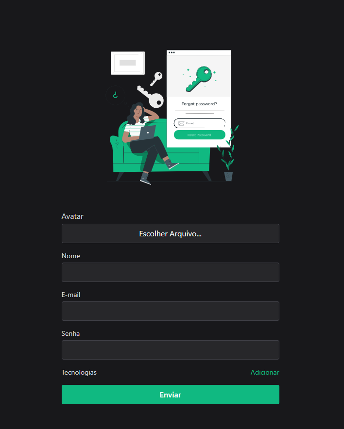

<h1 align="center">
  💻 Projeto
</h1>
<h4 align="center">
  Projeto criado para praticar e elevar conhecimentos e padrões de Desenvolvimento Front-end.
</h4>

## 🔎Preview

 <b>Link do Site:</b>  <a target="_blank" href='https://main--lambent-kataifi-b45a4e.netlify.app/'> Form </a>

---

## 💼 Tecnologias utilizadas

Para o desenvolvimento deste site utilizei as seguintes tecnologias:

- React.js

- TypeScript;

- libs

  - tailwindcss
  - zod
  - react-hook-form
  - supabase
  - react-toastify

  

---

## 📋 Descrição

A ideia do projeto é fazer a validação de formularios de forma avançada.

O projeto integra as bibliotecas react-hook-form e zod, para criar um schema com validação para verificar as entradas de dados do usuário, sem precisar de um estado para isso, tornando o processo mais simples.

Fiz a implementação do supabase para hospedar as imagens obtidas pelo formulário, mas deixei esse recurso desabilitado, pois caso queira testar ele não gravara suas fotos em nenhuma base de dados. Essa implementação foi apenas para aprendizado, afinal esse tipo de recurso seria de competencia do back-end.

Também nesse projeto foi aplicado o Composition Pattern; Esse Pattern basicamente consiste em um objeto que contem diversos sub-componentes, deixando o código limbo, e os componentes bem organizados.

---

## ▶Execução

Comandos necessários:

**npm install:** Baixa os pacotes necessários para executar o projeto. 

**npm run dev:** Executa o projeto;

